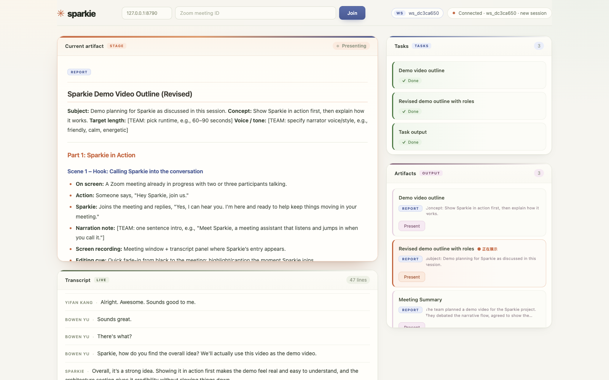
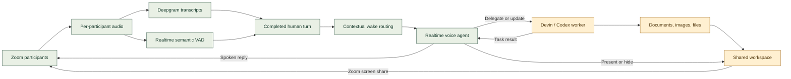

<p align="center">
  
</p>
<h1 align="center">Sparkie</h1>
<p align="center"><strong>Your AI teammate joins the call and GETS WORK DONE!</strong></p>
<p align="center">An AI meeting agent that listens, speaks, and gets work done while you keep talking.</p>
<p align="center">
  <a href="https://youtu.be/-kOeUK9_kIs">Demo video</a> &nbsp; / &nbsp;
  <a href="https://hope7happiness.github.io/sparkie">Website</a> &nbsp; / &nbsp;
  <a href="https://bowenyu066.github.io/sparkie">Interactive presentation</a> &nbsp; / &nbsp;
  <a href="#quick-start">Quick start</a>
</p>

[](https://youtu.be/-kOeUK9_kIs)

Sparkie joins Zoom as a participant, just like a real person. It follows the discussion, answers in context, and delegates research, writing and coding to a background agent while the meeting continues. All of these amazing things happen in the background while your team keeps talking, and Sparkie will come back with a result you can hear, open, and discuss in the shared workspace instantly.

## A conversation becomes a deliverable

Imagine you are planning a launch. The team has just debated two approaches.

> **You:** “Sparkie, compare the two options we just discussed. Turn that into a one-page recommendation and show it to us.”
>
> **Sparkie:** Sure, I can do that. I’ll start working on the document now and will let you know when it’s ready to review!
>
> **Keep discussing the rollout while the background agent works*
>
> **You:** “Add the risks we just agreed on to the document.”
>
> **Sparkie updates the document in the background and notifies you when it’s ready to review*

That's it, and the team can keep talking while Sparkie does the work. You no longer need to pause the meeting to take notes, research, or copy-paste the meeting notes to ask ChatGPT.

| In your meeting | Ask Sparkie to… | Bring back into the discussion |
| --- | --- | --- |
| Product planning | Research alternatives and compare tradeoffs | A sourced comparison or recommendation |
| Engineering review | Inspect the project and explain the relevant code | Findings, a plan, or a requested file change |
| Creative collaboration | Turn agreed ideas into an outline | A draft to review and revise together |
| Team coordination | Extract decisions and explicitly agreed responsibilities | An action list grounded in the conversation |

(Note: Tool-dependent work uses the selected worker’s available tools and integrations)

## Built for a live conversation

- **Context, not repeated prompts.** Per-participant transcripts preserve who said what, so you no longer need to repeat the discussion again and again in order to ask about “the second option” in the context.
- **A sense of when to speak.** Semantic turn detection waits for a complete thought, and wires with a fast wake routing model to decide whether to reply or delegate. You don't need to explicitly wake up the agent every time you want to ask a question.
- **Room to interrupt.** You can interrupt Sparkie’s spoken reply anytime to follow up, correct, or redirect, without having to wait for the agent to finish speaking.
- **Work in parallel.** A background worker handles research, documents, files, and commands while the voice agent stays available. You can ask for progress, updates, or cancellation.
- **Results everyone can discuss.** Sparkie can pull up a shared workspace and share it on the screen, so that everyone can instantly see task progress, Markdown documents, and images. You can control Sparkie to show, switch, or hide a ready artifact by voice, easy and fast.



---
*[The following sections are technical sections for engineers or agents]*

## Quick start

The primary demo path is **macOS + Zoom + en-US**. Run commands from the repository root.

### 1. Prepare your environment

You need:

- An Apple Silicon Mac with Xcode and the Zoom Meeting SDK. The native build baseline is **SDK 7.1.5.84750 / Xcode 26.2**; see [macOS setup](docs/zoom-macos.md).
- Python **3.11+**, [uv](https://docs.astral.sh/uv/), and Node.js **22.12+** with npm.
- Zoom Meeting SDK credentials, a meeting to join, and OpenAI / Deepgram API access.
- An installed, authenticated **Devin CLI** for the example configuration. Codex is also supported for background tasks.

```bash
uv sync --frozen
npm --prefix frontend ci
# First-time setup only; keep your existing .env if you have one.
cp -n .env.example .env
```

### 2. Add credentials and meeting details

Edit the local, Git-ignored `.env`:

| Setting | What to supply |
| --- | --- |
| `OPENAI_API_KEY` | Realtime voice and semantic turn detection |
| `DEEPGRAM_API_KEY` | Human speech transcription |
| `ZOOM_CLIENT_ID`, `ZOOM_CLIENT_SECRET` | Meeting SDK app credentials |
| `ZOOM_MEETING_ID`, `ZOOM_MEETING_PASSWORD` | Meeting number and passcode |
| `ZOOM_MACOS_SDK_PATH` | SDK extraction root containing `ZoomSDK/ZoomSDK.framework` |

The [example configuration](.env.example) selects Devin tasks, Gemini wake routing, semantic turn detection, and English transcription. Authenticate Devin with `devin auth login`; model availability depends on your account. For Zoom app authorization and any required join tokens, follow [manual setup](docs/manual-setup.md).

### 3. Build and join

Build the native receiver once, and again when its source changes:

```bash
uv run --frozen python scripts/zoom-sanity.py build --platform macos
```

Start Sparkie:

```bash
ZOOM_PLATFORM=macos bash scripts/zoom.sh --language en-US --seconds 3600
```

Admit Sparkie from the waiting room, handle any macOS permission prompts, and grant the SDK’s required recording/raw-audio permission. Wait for `listening_ready`, then try:

> “Hey Sparkie, can you hear me?”
>
> “Write a short outline from our discussion and show it to us.”

**The workspace starts with the call.** On macOS, Sparkie starts or reuses the local backend and frontend, then opens and requests sharing of the workspace after joining. Zoom host permissions still govern sharing. The services remain available after the meeting so you can view the results.

The default join budget is **10 minutes**, including waiting for admission. The `--seconds 3600` meeting duration starts at audio readiness. Use **Ctrl+C** to leave; finish any pending voice-session tasks first.

<details>
<summary><strong>Useful settings and troubleshooting</strong></summary>

| Setting | Default | Purpose |
| --- | --- | --- |
| `SPARKIE_ZOOM_JOIN_TIMEOUT_SECONDS` | `600` | Total join budget in seconds; increase for a longer wait |
| `SPARKIE_ZOOM_AUTO_WORKSPACE` | `1` | Start/reuse workspace services; set `0` to manage them yourself |
| `SPARKIE_WORKSPACE_SERVER` | `127.0.0.1:8790` | Workspace backend address |
| `SPARKIE_WEB_PORT` | `5178` | Workspace frontend port |
| `SPARKIE_TASK_BACKEND` | `devin` in the template | Select `devin` or `codex` for background work |
| `SPARKIE_WAKE_ROUTER` | `devin` in the template | Semantic routing; use `rules` for the local wake policy |

Switching the task backend to Codex does not switch the wake router: semantic wake routing still uses a separate Devin process. Restart affected services after changing configuration.

If workspace startup fails, voice can continue without sharing. Check `.runtime/workspace-services/backend.log` and `frontend.log`; a fresh clone needs `npm --prefix frontend ci` before automatic startup. For admission, permissions, or audio problems, see [Zoom setup](docs/zoom-macos.md) and [Realtime operation](docs/realtime.md).

</details>

## Under the hood

The voice agent participates in the conversation. The background agent does the longer work. They share task results without making the meeting wait.



| Role | Current example configuration |
| --- | --- |
| Meeting presence, audio, and sharing | Zoom Meeting SDK |
| Human transcription | Deepgram `nova-3` · `en-US` |
| Voice and semantic turn completion | `gpt-realtime-2.1` · medium semantic eagerness |
| Wake / reply decision | Gemini 3.5 Flash Minimal via Devin · `gemini-3-5-flash-minimal` |
| Background execution | Devin SWE 1.6 Fast · `swe-1-6-fast`, or Codex CLI |
| Artifact board | Python workspace service + Vite frontend |

Provider adapters are separate from [shared contracts](docs/interfaces.md). The worker receives finalized meeting context when a task is delegated; send later decisions as an explicit update or follow-up.

### Execution and data

Background workers reuse their CLI login and run in the project workspace with filesystem, shell, network, and configured tool access, without an approval gate or per-task timeout. The voice OpenAI key is not used for Codex CLI billing.

Meeting audio is processed by the configured speech providers. Local transcripts, events, and task records live under the Git-ignored `output/zoom/<session>/`. Treat those records and generated files as meeting data.

## Current scope

Real Zoom sessions have demonstrated audible replies, human interruption, false-interruption recovery, and background result reporting. The project remains a prototype; this is not a claim of universal latency or long-session reliability. See [speech handling](docs/semantic-turn-detection.md) and [session evidence](docs/realtime.md).

- **Primary path:** macOS Zoom in English. Linux has different input and sharing behavior.
- **Audio in, artifacts out:** Sparkie can share its workspace; it does not inspect other participants’ video or shared screens.
- **Speech remains probabilistic:** semantic completion and wake routing can misjudge a turn. Separate Zoom tracks exclude Sparkie’s own SDK track, but speakers can feed acoustic echo back through a human microphone.
- **Recovery is limited:** participant-input failures stop automatic speech and record a coverage gap; Realtime does not automatically reconnect.
- **Integrations are explicit:** email delivery and unsolicited participation are outside the current demo. External actions depend on available tools and a delegated request.

## Explore and contribute

| Looking for… | Start here |
| --- | --- |
| Credentials and native setup | [Configuration](docs/manual-setup.md) · [macOS SDK](docs/zoom-macos.md) |
| Voice operation and debugging | [Realtime guide](docs/realtime.md) · [Semantic turns](docs/semantic-turn-detection.md) |
| Architecture and contracts | [Interfaces](docs/interfaces.md) |
| Presentation and demo rehearsal | [Presentation](presentation/README.md) · [Demo script](presentation/sparkie-demo-script.html) |
| Demo rehearsal and collaboration | [Shared script](presentation/demo-script.html) · [Live editing](presentation/demo-script-sharing.md) |

<details>
<summary><strong>Offline development checks</strong></summary>

After installing dependencies, these run without API keys, Docker, SDK downloads, or network calls:

```bash
SPARKIE_WORKSPACE_SERVER=127.0.0.1:1 uv run --frozen python -m unittest discover -s tests -v
npm --prefix frontend test
npm --prefix frontend run build
```

Synthetic tests verify software flow, not real Zoom behavior. The workspace override isolates voice test fixtures from a running meeting. Before core changes, read the [interface contracts](docs/interfaces.md). Hand off the commit, run command, tested scope, and known limitations.

</details>

Built by [@Hope7Happiness](https://github.com/Hope7Happiness), [@YIFANK](https://github.com/YIFANK), and [@bowenyu066](https://github.com/bowenyu066).
